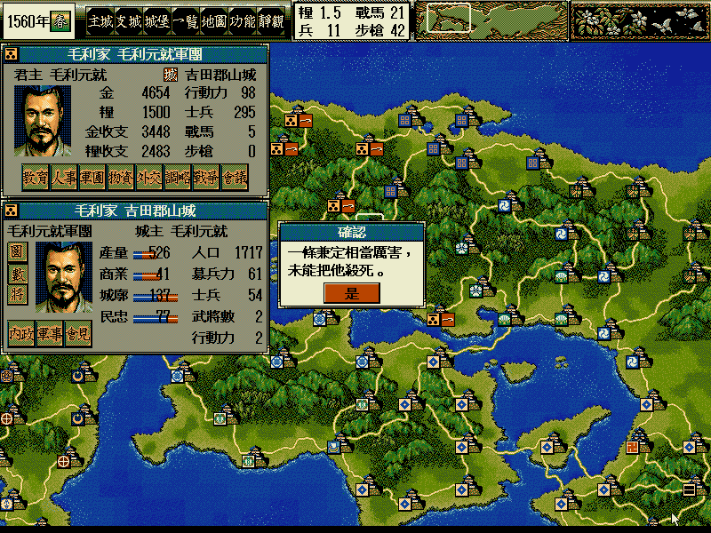
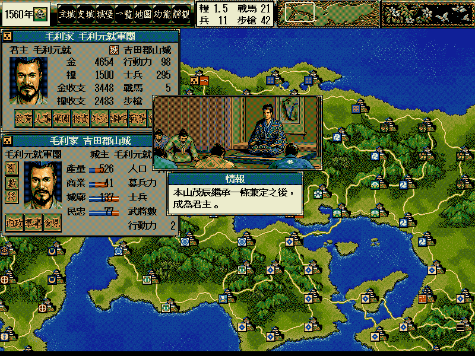
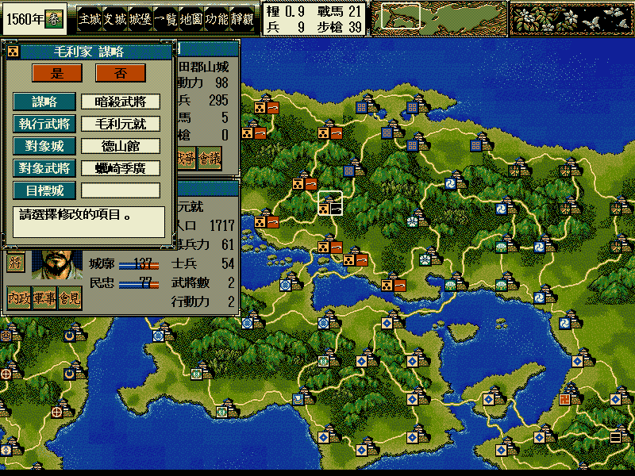
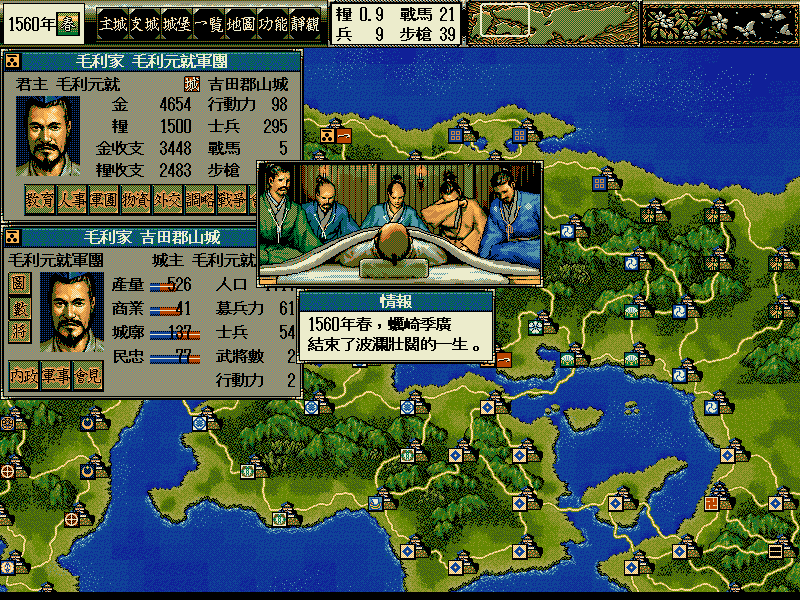
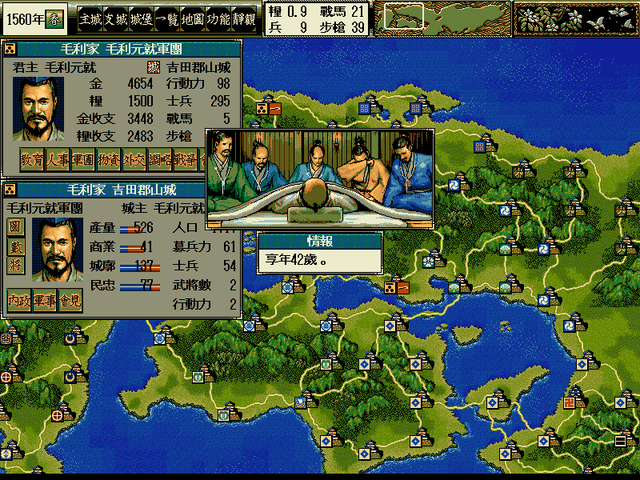
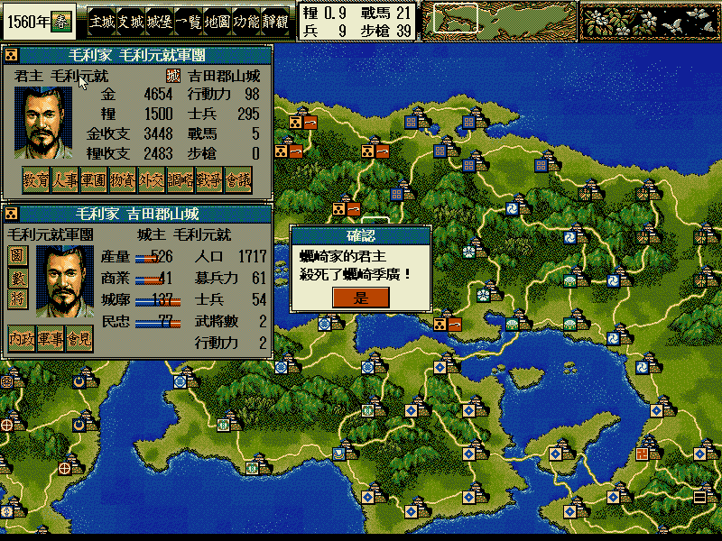

# 天翔記

## 劇本 [官位](官位.md) [寶物](寶物.md)

劇本|時間|勢力|軍團|家臣|浪人|隱居
:-:|:-:|:-:|:-:|:-:|:-:|:-:
信長の誕生|1534|67|97|294| 4|0
信長の元服|1546|65|96|398|11|0
桶狭間合戦|1560|57|82|423|13|1
信長包囲網|1571|53|81|430|15|1
本能寺の変|1582|38|60|444|14|1
関ヶ原前夜|1599| 2|16|442|28|1

## 信長の誕生（1534）

編號|地區|軍團|城堡|朝廷|家臣|勢力
:-:|:-:|:-:|:-:|:-:|:-:|:-:
01|東北|1|  1|  0|  2|蛎崎
02|東北|2|  4| 20|  5|南部
04|東北|1|  2| 20|  3|葛西
05|東北|1|  1| 25|  2|大崎
06|東北|2|  3| 30|  5|蘆名
07|東北|2|  2|  5|  2|二本松
08|東北|2|  2| 15|  4|相馬
09|東北|2|  3|  5|  3|戸沢
10|東北|1|  2|  5|  3|安東
11|東北|1|  1|  0|  2|大宝寺
12|東北|1|  2| 20|  3|最上
13|東北|1|  2| 55|  5|伊達
14|關東|2|  2| 35|  4|佐竹
15|關東|1|  2| 15|  2|小田
16|關東|2|  2| 20|  3|結城
17|關東|1|  1| 95|  3|古河足利
18|關東|1|  1| 10|  2|千葉
19|關東|1|  2|  5|  3|里見
20|關東|1|  1| 10|  2|那須
21|關東|2|  2| 25|  5|宇都宮
22|關東|2|  5| 70|  8|山内上杉
23|關東|1|  4| 55|  5|扇谷上杉
25|關東|1|  4| 25|  8|北条
26|東海|2|  7| 60| 11|今川
27|東海|1|  1| 15|  3|松平
28|東海|1|  2| 45|  3|斯波
29|東海|1|  2| 40|  5|織田
30|東海|1|  4| 45|  7|土岐
31|東海|2|  3| 65|  4|北畠
32|甲信|1|  2| 40| 11|甲斐武田
33|甲信|1|  3|  5|  5|村上
34|甲信|3|  5| 40| 11|小笠原
35|甲信|1|  1| 10|  2|三木
36|北陸|1|  1| 25| 13|長尾
37|北陸|1|  1|  5|  2|神保
38|北陸|1|  1| 35|  4|能登畠山
39|北陸|1|  4| 40|  7|朝倉
40|北陸|1|  1| 50|  3|若狭武田
41|近畿|1|  3| 10|  4|浅井
42|近畿|1|  4| 45|  6|六角
43|近畿|1|  1|100|  2|足利
44|近畿|4| 18| 85| 24|細川
47|近畿|4|  7| 90|  7|本願寺
49|近畿|1|  2| 65|  4|河内畠山
50|近畿|1|  2| 30|  3|筒井
51|中國|1|  2| 45|  2|一色
52|中國|2|  5| 50|  8|山名
53|中國|2|  8| 35| 13|尼子
55|中國|3|  3| 45|  8|赤松
56|中國|1|  5| 20|  6|浦上
58|中國|1|  2|  0|  3|三村
59|中國|1|  1|  5|  7|毛利
60|中國|3| 15| 80| 22|大内
61|四國|2|  5| 30|  6|河野
62|四國|1|  1| 15|  3|長宗我部
63|四國|2|  3| 75|  5|一条
64|九州|2|  6| 40| 13|大友
65|九州|1|  2| 10|  2|秋月
66|九州|1|  2| 10|  4|龍造寺
67|九州|1|  1| 60|  4|少弐
68|九州|1|  2| 30|  2|有馬
69|九州|1|  3| 35|  5|相良
70|九州|1|  1| 30|  2|阿蘇
71|九州|1|  3| 15|  6|伊東
72|九州|1|  3| 25|  4|肝付
73|九州|2|  3| 10|  7|伊作島津
74|九州|2|  3| 35|  5|宗家島津

## 信長の元服（1546）

編號|地區|軍團|城堡|朝廷|家臣|勢力
:-:|:-:|:-:|:-:|:-:|:-:|:-:
01|東北|1|1| 0|2|蛎崎
02|東北|1|0| 0|0|南部
04|東北|1|0| 0|0|葛西
05|東北|1|0| 0|0|大崎
06|東北|1|0| 0|0|蘆名
07|東北|1|0| 0|0|二本松
08|東北|1|0| 0|0|相馬
09|東北|1|0| 0|0|戸沢
10|東北|1|0| 0|0|安東
11|東北|1|0| 0|0|大宝寺
12|東北|1|0| 0|0|最上
13|東北|1|0| 0|0|伊達
14|關東|1|0| 0|0|佐竹
15|關東|1|0| 0|0|小田
16|關東|1|0| 0|0|結城
17|關東|1|0| 0|0|古河足利
18|關東|1|0| 0|0|千葉
19|關東|1|0| 0|0|里見
20|關東|1|0| 0|0|那須
21|關東|1|0| 0|0|宇都宮
22|關東|1|0| 0|0|山内上杉
23|關東|1|0| 0|0|扇谷上杉
25|關東|1|0| 0|0|北条
26|東海|1|0| 0|0|今川
28|東海|1|0| 0|0|斯波
29|東海|1|0| 0|0|織田
30|東海|1|0| 0|0|斎藤
31|東海|1|0| 0|0|北畠
32|甲信|1|0| 0|0|甲斐武田
33|甲信|1|0| 0|0|村上
34|甲信|1|0| 0|0|小笠原
35|甲信|1|0| 0|0|三木
36|北陸|1|0| 0|0|長尾
37|北陸|1|0| 0|0|神保
38|北陸|1|0| 0|0|能登畠山
39|北陸|1|0| 0|0|朝倉
40|北陸|1|0| 0|0|若狭武田
41|近畿|1|0| 0|0|浅井
42|近畿|1|0| 0|0|六角
43|近畿|1|0| 0|0|足利
44|近畿|1|0| 0|0|三好
47|近畿|1|0| 0|0|本願寺
49|近畿|1|0| 0|0|河内畠山
50|近畿|1|0| 0|0|筒井
51|中國|1|0| 0|0|一色
52|中國|1|0| 0|0|山名
53|中國|1|0| 0|0|尼子
55|中國|1|0| 0|0|赤松
56|中國|1|0| 0|0|浦上
58|中國|1|0| 0|0|三村
59|中國|1|0| 0|0|毛利
60|中國|1|0| 0|0|大内
61|四國|1|0| 0|0|河野
62|四國|1|0| 0|0|長宗我部
63|四國|1|0| 0|0|一条
64|九州|1|0| 0|0|大友
65|九州|1|0| 0|0|秋月
66|九州|1|0| 0|0|龍造寺
67|九州|1|0| 0|0|少弐
68|九州|1|0| 0|0|有馬
69|九州|1|0| 0|0|相良
70|九州|1|0| 0|0|阿蘇
71|九州|1|0| 0|0|伊東
72|九州|1|0| 0|0|肝付
73|九州|1|0| 0|0|島津

## 桶狭間合戦（1560）

編號|地區|軍團|城堡|朝廷|家臣|勢力
:-:|:-:|:-:|:-:|:-:|:-:|:-:
01|東北|1|1| 0|2|蛎崎

## 信長包囲網（1571）

編號|地區|軍團|城堡|朝廷|家臣|勢力
:-:|:-:|:-:|:-:|:-:|:-:|:-:
01|東北|1|1| 0|2|蛎崎

## 本能寺の変（1582）

編號|地區|軍團|城堡|朝廷|家臣|勢力
:-:|:-:|:-:|:-:|:-:|:-:|:-:
01|東北|1|1| 0|2|蛎崎

## 関ヶ原前夜（1599）

編號|地區|軍團|城堡|朝廷|家臣|勢力
:-:|:-:|:-:|:-:|:-:|:-:|:-:
27|全國|8|102|100|217|徳川
45|全國|8|112|100|227|豊臣

