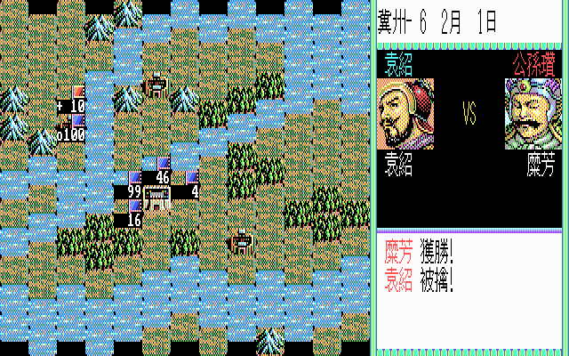
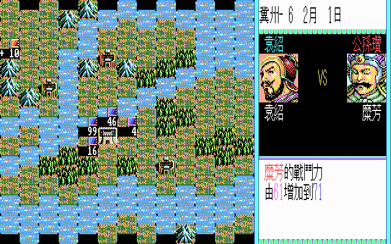
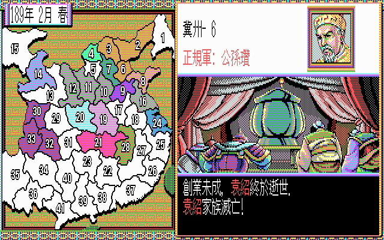
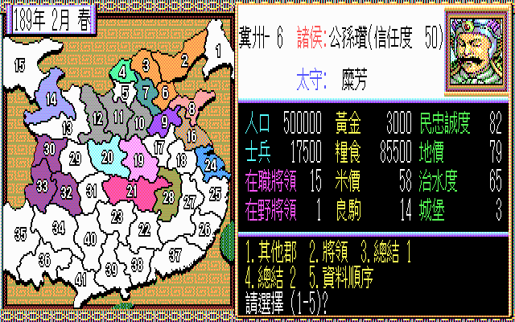

# 三國志 2
## 劇本
### 以劇本 1 為例

項目|hex|實際值|備註
-|:-:|:-:|-
年份|bc 00|188 年|00bc (H)
月份|0b|12 月|開局時 +1 月
勢力|0f|15 國|參與勢力數
勢力 0 顏色|03|藍紫|曹操、曹丕
勢力 1 顏色|06|綠色|劉備
勢力 2 顏色|0a|紅色|孫堅、孫策、孫權
勢力 3 顏色|01|黃色|袁紹、孟獲
勢力 4 顏色|04|粉紅|袁術、公孫淵
勢力 5 顏色|05|靛色|馬騰
勢力 6 顏色|0b|深紫|劉焉、劉璋
勢力 7 顏色|08|淡藍|劉表
勢力 8 顏色|00|灰色|董卓、呂布
勢力 9 顏色|0f|橘色|公孫瓚
勢力 a 顏色|02|土橘|陶謙、張魯
勢力 b 顏色|0e|深綠|韓馥、金旋
勢力 c 顏色|0c|膚色|孔融、韓玄
勢力 d 顏色|09|藍色|王朗、趙範
勢力 e 顏色|0d|土黃|劉繇、劉度
勢力 f 顏色|07|水藍|新諸侯

## [人物](https://reganlu007.github.io/san2/man)
### 以劉備為例

項目|hex|實際值|備註
-|:-:|:-:|-
年分|XX||TAIKI.DAT 特有設定，登場年分
跟隨|XX||TAIKI.DAT 特有設定，跟隨人物 (父親 or 君主)
所在|XX||TAIKI.DAT 特有設定，值 = 州郡號碼 - 1
凶兆|0 |無|1 = 過年後死亡
狀態|0 |正常|1 = 內應，2 = 埋伏
內應|0 |0 個月|時間內必定叛變
留守|0 |0 個月|時間內無法行動
才智|55| 85|(一般) 計謀、開墾、治水上升幅度 (補給) 物資完整程度 (軍師) 建言準確程度 (太守) 他國使者發現機率 (戰鬥) 誘導、放火成功率
戰鬥|46| 70|(一般) 軍事、治水上升幅度 (補給) 物資完整程度 (使者) 被抓時逃脫率 (戰鬥) 單挑初始體力、攻擊傷害程度
號召|63| 99|(一般) 登用、計謀、開墾、供給上升幅度 (太守) 獎賞效果 (戰鬥) 叛節效果
義理|64|100|(一般) 不叛變率 (太守) 不獨立率 (戰鬥) 不叛變率
人德|64|100|(太守) 所屬民眾忠誠、部下忠誠維持度
野望|55| 85|(太守) 獨立率、擴張慾 (戰鬥) 單挑自行應戰率、攻擊傷害程度
從屬|01|劉備|ff = 在野
忠誠|64|100|不叛變率
仕官|01|1 年|
潛伏|ff|無|內應/埋伏勢力來源，無 = ff 有機會被他國登用
未知|00||部隊編號？
相性|32|50|曹操 = 01 (H) = 1 劉備 = 32 (H) = 50 孫權 = 64 (H) = 100
血緣|02 00|劉備|見[血緣](https://reganlu007.github.io/san2/#州名血緣同盟)
兵力|10 27|10000|2710 (H)
武裝|e8 03|1000|03e8 (H)
訓練|0a|10|
未知|00 00||部隊座標？
生年|a1|西元 161 年|
ＣＧ|a1 00|編號 161 號|00a1 (H) 大眾臉譜組合方式待考
姓名|a6 ab 9f ab 00 00|劉備|

## 州郡
### 以 19 州為例

項目|hex|實際值|備註
-|:-:|:-:|-
黃金|e8 03|1000|03e8 (H)
糧食|50 c3 00 00|50000|0000c350 (H)
人口|28 23|9000|2328 (H)
從屬|01|勢力 1|劉備
未知|ff 00 00 ff ff||
地價|32|50|影響收入
民忠|32|50|影響收入、暴動機會
治水|28|40|影響防災
名馬|14|20|
城堡|04| 4|
米價|32|50|
未知|a5 00 bf 00||
座標|04 04|(4,4)|見[座標](https://reganlu007.github.io/san2/#座標)
州名|0a|編號 0a|見[州名](https://reganlu007.github.io/san2/#血緣同盟州名)

## 血緣、同盟、州名

編號|血緣|編號|同盟|編號|州名
:-:|:-:|:-:|-|:-:|-
00 00|無  |00 00|無|00|幽州
01 00|曹操|01 00|與勢力 01 同盟|01|并州
02 00|劉備|02 00|與勢力 02 同盟|02|冀州
04 00|孫堅|04 00|與勢力 03 同盟|03|青州
08 00|袁紹|08 00|與勢力 04 同盟|04|兗州
10 00|袁術|10 00|與勢力 05 同盟|05|司州
20 00|馬騰|20 00|與勢力 06 同盟|06|雍州
40 00|劉焉|40 00|與勢力 07 同盟|07|涼州
80 00|劉表|80 00|與勢力 08 同盟|08|徐州
00 01|董卓|00 01|與勢力 09 同盟|09|予州
00 02|公孫瓚|00 02|與勢力 10 同盟|0a|荊州
00 04|張魯|00 04|與勢力 11 同盟|0b|揚州
00 08|孟獲|00 08|與勢力 12 同盟|0c|益州
00 10|血緣 13|00 10|與勢力 13 同盟|0d|交州
00 20|血緣 14|00 20|與勢力 14 同盟
00 40|血緣 15|00 40|與勢力 15 同盟
00 80|新諸侯|00 80|與勢力 16 同盟
ff ff|全血緣|ff ff|與全國勢力同盟

## 座標

@|0|1|2|3|4|5|6|7
:-:|:-:|:-:|:-:|:-:|:-:|:-:|:-:|:-:
0|  |  |  |  |  | 2| 1|
1|  |  |  | 4| 3| 6|  |
2|  |  |  | 5| 7| 9| 8|
3|15|  |  |11|10|17|16|24
4|14|13|12|20|19|28|18|25
5|  |30|29|31|21|22|27|26
6|  |33|32|40|23|38|37|
7|  |35|34|41|39|  |  |
8|  |  |36|  |  |  |  |

## 勢力

### 以劇本 2 呂布為例

項目|hex|實際值|備註
-|:-:|:-:|-
信用|1e|30|
未知|00 ff ??||不定值
同盟|00 00|無|見[同盟](https://reganlu007.github.io/san2/#州名血緣同盟)
未知|?? ??||不定值
敵對|41 32 32 32 32 32 32 32 32 32 32 32 32 32 32 32|65 50 50 50 50 50 50 50 50 50 50 50 50 50 50 50|勢力 0、勢力 1、勢力 2、勢力 3 勢力 4、勢力 5、勢力 6、勢力 7 勢力 8、勢力 9、勢力 a、勢力 b 勢力 c、勢力 d、勢力 e、勢力 f
共同|ff ff ff|無 無 無|邀請勢力 目標都市 目標所屬
姻親|ff|無|
協防|ff|無|

## 寶物

編號|效果|分類|地點|HEX|名稱
:-:|:-:|:-:|:-:|-:|:-:
00|一般|書籍|08|ba b3 c4 de b3 c9 bc ae|王道の書
00|一般|書籍|0a|ca c4 de b3 c9 bc ae|霸道の書
01|一般|刀劍|08|b7 de ae b8 d8 dd c9 b9 dd|玉鱗の剣
01|一般|刀劍|08|ca bc de ac c9 b9 dd|破邪の剣
01|一般|刀劍|05|ba b3 b3 c9 b9 dd|項羽の剣
01|一般|刀劍|0a|be b2 d8 ad b3 c9 b9 dd|青龍の剣
02|一般|美女|0a|cc d6 b3 cb d2|芙蓉姬
02|一般|美女|05|b6 b8 bc|郭氏
02|一般|美女|05|ca dd bc|樊氏
02|一般|美女|0a|bd b3 bc|鄒氏
02|一般|美女|08|b7 ad b3 d6 b3 b7|弓腰姬
03|一般|名馬|00|be b7 c4 ca de|赤兔
03|一般|名馬|00|c3 b7 db|的盧
04|一般|醫書|00|b6 c0 de c9 b2 b6 de b8 bc ae|華佗の医学書
05|一般|玉璽|00|b7 de ae b8 bc de|玉璽
06|超級|書籍|ff|d3 b3 c4 b8 bc dd bc ae|孟德新書
06|超級|書籍|ff|bf dd bc c9 cd b2 ce b3 bc ae|孫子の兵法書
06|超級|書籍|ff|c0 b2 cd b2 d6 b3 bc de ad c2 c9 bc ae|太平要術の書
07|超級|刀劍|ff|be b2 ba b3 c9 b9 dd|青釭の剣
07|超級|刀劍|ff|b2 c3 dd c9 b9 dd|倚天の剣
07|超級|刀劍|ff|bc c1 be b2 c9 b9 dd|七星の剣
08|超級|美女|ff|c0 de b2 b7 ae b3|大喬
08|超級|美女|ff|c4 b3 bc de ae|董女
08|超級|美女|ff|bc ae b3 b7 ae b3|小喬
09|超級|名馬|ff|ca d4 c3|疾風
09|超級|名馬|ff|ba b8 d8 ad b3|黑龍
09|超級|名馬|ff|ba dd db dd|崑崙
0a|超級|玉璽|ff|b6 dd c9 b7 de ae b8 bc de|漢の玉璽

## 凶兆

凶兆は出る武将が決まっていて、決められた年からランダムで発生。

出た場合は次の年の１月に死亡してしまう。

武将|沒年|HEX
:-:|:-:|:-:
孫堅|191|00 bf
孫策|199|00 c7 
袁紹|201|00 c9 
郭嘉|206|00 ce
周瑜|209|00 d1
荀彧|211|00 d3
荀攸|213|00 d5
呂蒙|218|00 da
諸葛亮|233|00 e9

## 189 公孫瓚單挑滅袁紹

1 月 S/L 登庸文醜、糜芳 (使用名馬比較容易登庸)

2 月 S/L 登庸顏良，公孫越佔領地 2，糜芳進攻地 6，挑贏袁紹即可快速取勝

